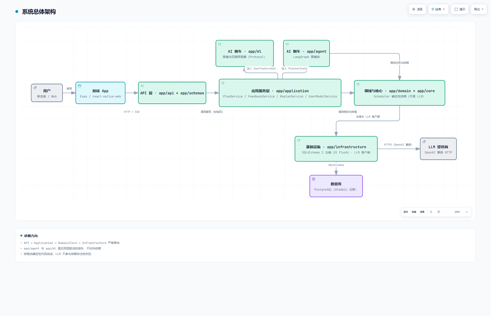
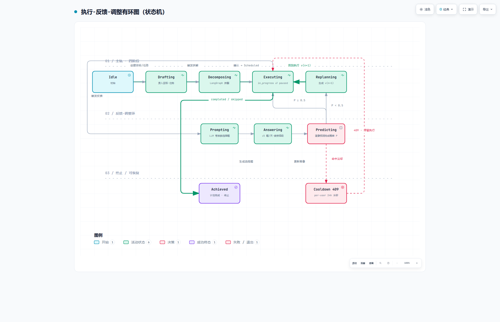
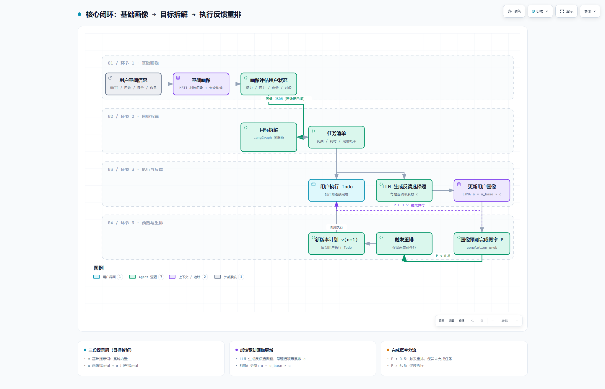
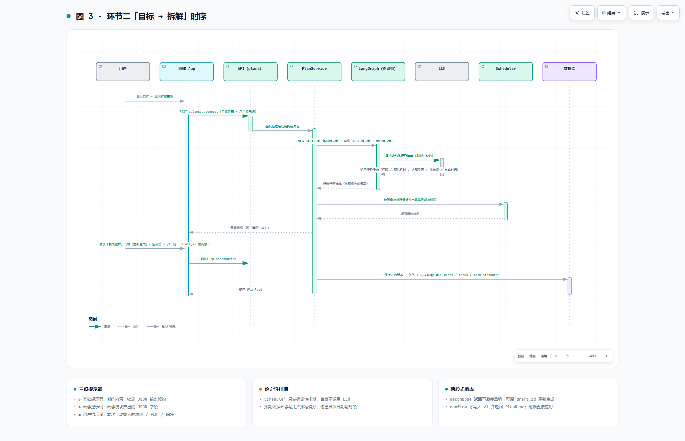
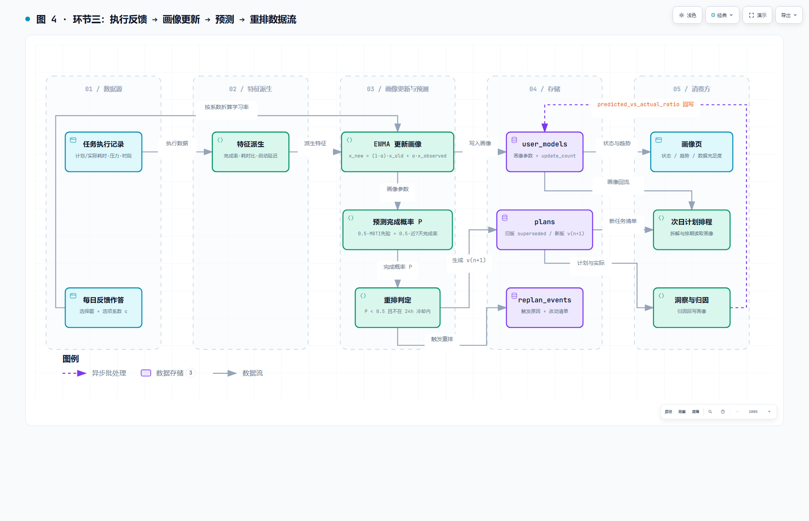
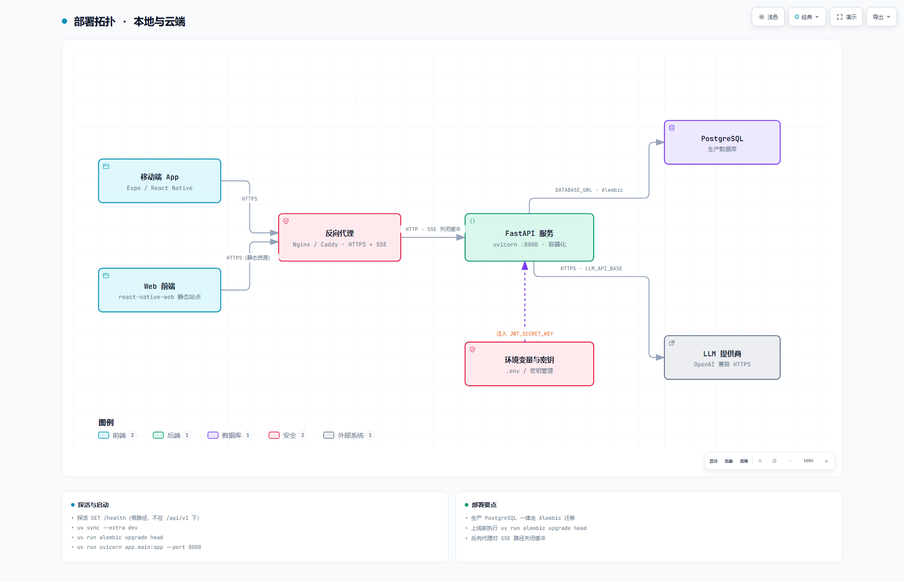

# 面向长期目标执行的自适应任务规划系统

## 一、产品概述

### 1.1 背景与痛点

**行业背景。** 大模型让"生成计划"第一次变得廉价：输入一句"我想三个月过六级"，任何通用助手都能在几秒内吐出一份看起来合理的计划。但从产品视角看，这条路走不通——**生成不等于可执行，可执行不等于能坚持**。当前 AI 软件在"长期目标执行"这一场景存在三个真实痛点：

- P1**目标无法落地为可执行步骤**——"过六级"要拆成每天背多少单词、做几套真题，用户自己拆不动，拆完也排不出日程。现有工具的失效方式：通用待办工具只提供空白清单；通用 LLM 助手给的是一次性长文本，无法进入日程。
- P2**估时系统性失真**——人们普遍低估任务耗时，且低估幅度因人而异；低估直接导致当天计划完不成。现有工具的失效方式：待办工具的"预估耗时"是用户自己填的静态数字，永不校准。
- P3**计划对人的状态波动零免疫**——熬夜、加班、情绪低落的一天结束后，整份计划成为一个"欠债清单"，用户随即放弃。现有工具的失效方式：番茄钟/习惯打卡类工具只统计打卡，不改变计划；一旦断档，计划作废。

**产品目标。** 构建一个**面向长期目标执行的自适应任务规划系统**：让 AI 承担"把模糊目标拆成一步可完成任务 + 排出到天的日程"这件高成本的事；把用户的静态画像（MBTI  + 大众平均值）与动态状态（精力/压力/疲劳/效能）作为 AI 拆解与排程的**结构化输入**；并用"执行反馈 → 画像更新 → 完成概率预测 → 过低自动重排"的闭环，让**计划跟着人的状态走**，而不是要求人去迁就计划。

**研发意义。** 本作品要回答的是**"如何把 LLM 的开放生成能力，装进一个有确定性约束、有状态记忆、有自适应反馈回路的软件系统里"**，算法给候选，软件系统给约束、记忆与闭环。

### 1.2 产品定位与目标用户

**产品类型**：AI 赋能软件 / 智能应用系统（含在线服务）。后端 FastAPI 服务 + 移动/Web 前端（Expo + react-native-web）。

**目标用户**：

- **在校学生**——典型长期目标为备考（四六级、考研、考证）、课程项目；核心痛点P1 拆不动、P2 估不准、P3 作息不规律。
- **在职青年**——典型长期目标为健身减脂、技能学习、副业推进；核心痛点P2 可用时间每天不同、P3 加班后崩盘。
- **自我管理型用户**——典型长期目标为多目标并行（同时推进 2–3 件长期事项）；核心痛点P1 粒度混乱、P3 计划冲突。

**核心功能与应用场景**：

1. **基础画像与状态评估**——用户注册时填写个人基础信息初始化基础画像，并持续评估用户当前状态。
2. **目标 → 任务拆解**——用户创建目标并手动触发拆解，LangGraph 以「基础提示词 + 画像提示词 + 用户提示词」驱动 LLM 产出任务清单（草案预览 → 确认落库）。
3. **执行反馈与自适应重排**——执行 Todo 后，由 LLM 生成带系数的反馈选择题；反馈按系数折算 EWMA 学习率更新画像；画像预测任务完成概率，概率过低时自动重排并生成新版本计划。

**差异化优势（与同类相比）**：

| 维度 | 通用待办 / 番茄钟 / 打卡 | 通用 LLM 助手 | 本系统 |
| --- | --- | --- | --- |
| 算法精度 | 无预测能力，纯记录 | 单次生成，无校准 | MBTI 先验 + 近 7 天完成率加权 → 反馈驱动的 EWMA 持续校准 |
| 运行效率与稳定性 | 轻，但不解决计划问题 | 生成质量随 prompt 波动，输出不可控 | LLM 只产出结构化 JSON，落库前过 schema 契约校验；排期由 Scheduler 纯确定性生成、永不调 LLM |
| 场景适配性 | 只适配"记得住就行"的浅任务 | 一次对话，无法跨天跟踪 | 三段提示词把画像 JSON 作为固定输入，拆解结果随人变化；重排闭环让计划随状态滚动 |
| 可解释性 | 无 | 不可复现 | 每次重排记录触发原因与改动清单，计划版本可回退 |

**一句话定位**：**一个"以画像为输入、以确定性排期为边界、以反馈为驱动"的长期目标执行系统**——AI 负责拆解与预测，确定性代码负责排期，反馈闭环负责让人不用重写计划。

### 1.3 核心技术与本文贡献

本系统的技术核心是一条由三个环节构成的闭环：**基础画像与状态评估**把用户状态变成可计算参数，**目标拆解**用三段提示词与图编排把模糊目标变成任务清单，**执行反馈与自适应重排**用带系数的反馈更新画像、再用完成概率预测驱动计划滚动。围绕这条闭环，本文的主要贡献如下：

1. **有环图 + 状态机建模**：把"添加目标/任务 → 用户执行 → 用户反馈 → 智能体调整"建成有环图，并给出由可判定事件驱动的显式状态机（创建 / 执行 / 反馈 / 调整四阶段 + 回到执行的环）。
2. **三段提示词 + 画像 JSON 契约**：把"用户状态"从自然语言描述变成 LLM 的一等结构化输入，使拆解结果可随画像解释、可稳定复现。
3. **反馈即带系数的选择题**：每个选项携带系数 `c ∈ [0,1]`，折算 EWMA 学习率 `α = α_base × c`，把主观反馈变成画像更新的梯度。
4. **以预测概率作为重排触发量**：画像预测每条任务的完成概率 P，`P < 0.5` 即触发重排，把自适应从"事后补救"提前到"事前预警"。
5. **契约化输出 + 确定性排期**：LLM 只产出符合 JSON 契约的候选任务，日期与时段由确定性 Scheduler 生成，把概率生成与合法性判定分离。
6. **计划版本不可变 + 重排可解释可回退**：每次重排生成 `v(n+1)`、旧版标 `superseded`、写 `parent_plan_id` 与 `ReplanEvent`，让自适应行为可追溯。
7. **可验证的自适应**：确立证据分级、带开关上线、n-of-1 / 时间序列优先的实验纪律，避免"改了但没有证据说明它更好"。

## 二、技术架构与创新

### 2.1 总体架构

系统采用**四层架构 + 两个 AI 侧车**，依赖方向严格单向：API → Application → Domain/Core → Infrastructure。总体架构**如图 1 所示**：节点自上而下为用户 → 前端 App（Expo / react-native-web）→ API 层（`app/api` + `app/schemas`）→ 应用服务层（`app/application`）→ 领域与核心（`app/domain` 的 Scheduler、`app/core`）→ 基础设施（SQLAlchemy 2 仓储、LLM 客户端），并可访问数据库（PostgreSQL）与 LLM 提供商（OpenAI 兼容 HTTPS）；`app/agent`（LangGraph 编排）与 `app/ml`（画像与四路预测器 Protocol）作为**仅由应用层驱动的 AI 侧车**挂在应用服务层侧。硬约束校验引擎（RuleEngine）不在本图的主链路上——它属下一阶段模块。



图 1  系统总体架构（四层 + 两个 AI 侧车；RuleEngine 属下一阶段，不在主链路）

各模块功能与数据交互关系如下：

- **API 层**（`app/api/v1/plans.py`、`app/api/v1/feedback.py`、`app/api/v1/mappers.py`）：校验输入、调用服务、映射为 `app/schemas` 响应；SSE 推送生成阶段。只依赖 Application，不返回 ORM/领域对象。
- **应用层**（`app/application/services/plan_service.py`、`feedback_service.py`、`replan_service.py`、`user_model_service.py`）：组装 `PlannerState` 并驱动 LangGraph；落库计划版本；反馈与重排事务。向 agent/ml 注入依赖，不反向被依赖。
- **AI 侧车 · 编排**（`app/agent/graph.py`、`app/agent/state.py`、`app/agent/nodes/*`）：图编排 `goal_analysis → theoretical_analysis → user_situation_analysis → plan_generation`（校验—修复节点 `rule_validation` ⇄ `plan_repair` 属下一阶段，位置已在图中预留）。通过 `PlannerState` 接收画像与特征，**不开数据库会话**。
- **AI 侧车 · 预测**（`app/ml/predictors.py`、`user_model.py`、`completion_predictor.py` 等）：画像构建（特征派生）、完成概率/耗时/压力/时段预测。以 Protocol 暴露，由应用层注入。
- **领域层**（`app/domain/scheduling/scheduler.py`、`app/domain/models/`）：Scheduler 在约束内做确定性启发式排期（**永不调 LLM**）；硬约束校验引擎（RuleEngine）作为下一阶段模块，当前以离线实验验证。不导入 FastAPI/SQLAlchemy，零 I/O，可纯单元测试。
- **基础设施**（`app/infrastructure/database/`、`llm/client.py`）：仓储（只 `flush` 不提交）、OpenAI 兼容 LLM 客户端。由应用层注入，实现可整体替换。


### 2.2 技术选型与依据

| 技术 | 选型 | 依据 |
| --- | --- | --- |
| 编排 | **LangGraph** | 计划生成是"有状态"的多阶段流程，且每个阶段要落成可观测的 SSE 事件名：图编排把节点与事件名一一对齐；条件边位置已为下一阶段的"校验—修复"回边预留 |
| LLM 接入 | **OpenAI 兼容 `LLMClient` Protocol** + 结构化 JSON 输出 + **Pydantic v2** 校验 | 把 LLM 输出约束为可落库的结构；协议化保证"换模型不改业务代码" |
| 画像与状态更新 | **MBTI 先验模板 + EWMA**（`α = α_base × c`） | 冷启动无任何历史数据，必须先验；EWMA 计算量恒定、可解释、无需训练样本，且学习率可由反馈系数调节 |
| 预测 | **分层可替换的 Predictor Protocol**（耗时/完成/压力/时段） | 冷启动走规则先验，有历史后走统计估计；未来接训练模型只需实现同一 Protocol |
| 约束 | **Scheduler**（确定性启发式，`app/domain/scheduling/scheduler.py`）；硬约束校验引擎（**RuleEngine**，7 条约束的离线实验）列为下一阶段 | LLM 是概率系统，不应直接决定排期合法性；排期必须由确定性代码产生 |
| 后端 | **FastAPI + Pydantic v2 + SQLAlchemy 2 + Alembic**，数据库统一 PostgreSQL | 类型安全、迁移可追溯；开发与生产同库，避免方言差异 |
| 工程 | **Python 3.12 + uv**，ruff（line length 100） | 依赖与环境隔离，构建可复现 |
| 前端 | **Expo SDK 57 + react-native-web + expo-router** | 一套代码同时交付移动端与 Web 演示地址，便于评审验证 |

**选型总原则**：**AI 与规则分离、每一层都可替换**。LLM 客户端、智能体、预测器、Scheduler、数据库，每一处都有明确的替换缝（`app/architecture.md` 的 Replacement seams），保证算法升级不会牵动业务逻辑。

### 2.3 关键创新

**创新点 1：把"添加目标/任务 → 用户执行 → 用户反馈 → 智能体调整"建成有环图，并落地为显式状态机。**
主流计划工具把上述四步当作**一次性流水线**：生成计划 → 执行 → 结束。本系统把它建成**有环图（cyclic graph）**——智能体调整阶段产出新版本计划 `v(n+1)` 后，边回到"用户执行"；环上的每一圈对应一次计划版本迭代（旧版置 `superseded`，并由 `ReplanEvent` 记录触发原因与改动清单）。环上的四个宏观阶段进一步落地为**显式状态机**，使每次迁移都由可判定的事件触发、并有持久化落点：

- **A 创建**：`Idle` →（录入目标/任务，`GoalStatus.draft`）`Drafting` →（LangGraph 图编排 + 三段提示词）`Decomposing` →（草案预览）`AwaitingConfirm` →（确认落库）`Scheduled`。
- **B 执行**：`Scheduled` →（开始）`Executing`（`TaskStatus.in_progress`）⇄（暂停）`Paused` →（`completed` / `skipped`）`Recorded`。
- **C 反馈**：`Prompting`（LLM 生成带系数选择题，≤5 题/天、疲劳降级为 1 题）→ `Answering` →（EWMA 更新画像，写 `user_models`）`ProfileUpdated`。
- **D 调整**：`Predicting`（画像预测完成概率 P）→（`P < 0.5` 且不在 per-user 24 小时冷却内）`Replanning`（生成 `v(n+1)`、旧版 `superseded`、写 `ReplanEvent`）→ **回到 B 的 `Executing`，环闭合**。
- **分支与终止**：`P ≥ 0.5` → 直接回到 `Executing`；命中冷却 → 停留在 `Executing` 并返回 `409 next_eligible_at`（可恢复，不进入终态）；目标全部达成 → 终态 `Achieved`。

**为什么是有环图而不是流水线。** ① 反馈必须能改变**后续**拆解，而不是只写进报表——只有环才能把 `ProfileUpdated` 的输出接回 `Decomposing`；② 重排必须能**反复发生**且可解释、可回退，因此环上每次迭代都要版本化（`v(n+1)` 与 `parent_plan_id`）；③ 状态机的迁移条件是**可判定的量**（完成率、预测概率、冷却是否命中），把"人的状态波动"变成系统能响应的事件，而不是靠用户自己重写计划。该状态机**如图 2 所示**。



图 2  执行-反馈-调整的有环图与状态机（A 创建 → B 执行 → C 反馈 → D 调整，环回到执行）

**创新点 2：三段提示词 + 画像 JSON 契约——把"用户状态"变成 LLM 的一等输入。**
同类 AI 计划工具把用户信息塞进一段自然语言 prompt，导致同一用户两次拆解结果不稳定、画像无法被程序消费。本系统固定三段结构：**基础提示词**（系统角色、拆解原则、输出 JSON 契约）+ **画像提示词**（画像模块产出的 JSON：耗时倍率、完成概率先验、精力/压力/疲劳、偏好时段、拖延倾向、是否减负）+ **用户提示词**（本次手动输入的要求）。画像因此从"描述"变成"参数"，拆解结果可随画像变化而被解释；"重新生成"只需替换第三段，前两段保持不变。

**创新点 3：反馈即带系数的选择题——把主观反馈变成可计算的学习率。**
让用户填"完成率 0.62、压力 4"这类自由表单，既枯燥又不可比。本系统由 LLM 依据当日执行情况生成 **≤5 题的选择题**（精力、压力、可投入时间、完成状态、费劲程度、卡点），**每个选项带一个系数 c ∈ [0,1]**，系数直接折算 EWMA 学习率 `α = α_base × c`：答"完全没完成且太费劲"对画像的改动权重，与"轻松完成"不同。反馈因此不再是统计报表，而是**画像更新的梯度**。

**创新点 4：以预测概率作为重排触发量——从"事后补救"到"事前预警"。**
同类工具的"重排"往往由用户手动触发。本系统由画像预测每条任务的完成概率 P，**P < 0.5 即自动重排**（配合当日完成率校准），在用户彻底崩盘之前就把计划降载。

**创新点 5：契约化输出 + 确定性排期——把概率生成与合法性判定分离。**
LLM 只负责产出符合 JSON 契约的任务候选，落库前必须过 schema 校验；具体日期与时段由确定性 Scheduler 生成，**LLM 不参与排期合法性判定**。这一分层为下一阶段接入硬约束校验引擎（RuleEngine：违规清单回灌重生成）预留了唯一插口——把不确定性挡在排期之外，是"AI 生成的日程可信"的前提。

**创新点 6：计划版本不可变 + 重排可解释可回退。**
每次重排生成 `v(n+1)`、旧版标 `superseded`、写 `parent_plan_id` 与 `ReplanEvent`（触发原因 + 改动清单）。用户随时能看到"系统改了我未来哪几天、为什么"，并可一键回退——自适应的前提是**信任**，而信任来自可解释。

**创新点 7：可验证的自适应——证据纪律先于功能堆叠。**
自适应系统最大的风险是"改了但没有证据说明它更好"。本项目确立了三条实验纪律：① 证据分级（强证据才固化为硬约束，中等证据做成可开关的默认行为，弱证据只记录）；② 任何自适应策略上线前必须带实验开关，**禁止无对照全量上线**；③ 采用 n-of-1 / 时间序列优先、再上群体 A/B 与微随机试验（MRT）的验证路径。相关设计见本项目研究台账 `docs/research/RO-7-证据制度与术语.md:63-77`、`docs/research/RO-8-路线与验证.md:254-272`、`:307`。

**与同类方案的取向一致。** 本系统采用"先小步修正、必要时才整体重排"的取向（阶梯式重排：顺延均摊 → 局部修复 → 系统性重排，见 `docs/需求共识.md` §6.7 对 `docs/research/` 文献台账的核查记录），与滚动时域、局部修复优先的排程研究方向一致：避免频繁整体重排导致用户对计划失去稳定预期。

---

## 三、核心闭环的设计与实现

### 3.1 闭环总览

本系统的唯一核心闭环由三个环节构成：环节 1 基础画像、环节 2 目标 → 拆解、环节 3 执行 → 反馈 → 重排（定义见 `docs/fin/核心闭环.md`），**如图 3 所示**。环节 1 由"用户基础信息"经"MBTI  + 大众平均值"生成基础画像并评估用户状态；环节 2 用户手动触发拆解，三段提示词（基础 / 画像 JSON / 用户输入）汇入 LangGraph 图编排生成任务清单；环节 3 执行后由 LLM 生成带系数的反馈选择题，经 EWMA 更新画像、预测完成概率，`P < 0.5` 时触发重排并回到执行；画像 JSON 同时回流至环节 2 的画像提示词。



图 3  核心闭环（三环节 + 画像 JSON 回流）

三个环节是**同一条因果链**：画像给底座 → 画像喂拆解 → 反馈养画像。闭环成立的关键在于**回流**：环节 3 产出的新画像，同时供环节 1 的状态评估与环节 2 的画像提示词使用。

### 3.2 环节一：基础画像与状态评估

**（1）冷启动输入采集。** 首次使用时一次性采集 MBTI 类型（或四维百分比）、身份标识、作息与每日可投入时间。设计遵循"**能算就不问**"原则：慢的、稳定的、主观体验的靠问；快的、可观测的、行为副产物的靠算。

**（2）MBTI 模板 + 大众平均值 → 基础画像。**
16 种类型各配一份 **8 字段模板**（耗时倍率、完成概率先验、压力基线、精力消耗速率、行动力、拖延倾向、偏好时段、压力响应方式），另有一份 `_default` 模板即**大众平均值**。用户填了四维百分比时按比例加权初始化（如 I 65%/E 35% → `0.65 × 类型A + 0.35 × 类型B`），比硬分类更精细；未填则直接取 `_default`。

画像字段分两类：

- **静态字段**（注册后不变）：`mbti_type`、四维百分比、`identity`。
- **动态字段**（随反馈更新）：`duration_factor`、`completion_prob`、`stress_baseline`、`energy_drain_rate`、`proactive_score`、`procrastination_tendency`、`preferred_time_slots`、`stress_response`、`state_energy`、`state_fatigue`、`self_efficacy`、`update_count`。

模板数值为可调工程取值，作用是提供**冷启动先验**，随后由真实反馈逐步覆盖。

**（3）画像评估用户状态。** 由 `app/agent/nodes/user_situation_analysis.py` 在每次生成/反馈后聚合四路预测（耗时、完成、压力、时段），产出状态结论：

- `duration_factor`、`completion_ability`、`stress_state`、`fatigue_state`、`recommended_time_slot`、`should_reduce_load`、`confidence`。

当 `update_count < 3` 时标记 `degraded`，Scheduler 自动追加 20% 缓冲。输出为**画像 JSON**，供环节 2 与环节 3 消费。

### 3.3 环节二：目标拆解（LangGraph 编排）

**（1）触发与交互。** 用户创建目标（支持一次多条）后**手动触发**"拆解"。系统先出**草案预览**：用户可增删改任务、调整粒度，也可点"重新生成"（可附对上一版的意见）。确认后才落库并排期。取消时目标以草稿保留，不丢弃。

**（2）三段提示词拼接（本环节的技术核心）。** 三段提示词的组装逻辑见 4.2.1 节算法 1：**基础提示词**固定不变，负责系统角色与 JSON 输出契约；**画像提示词**来自画像模块产出的 JSON；**用户提示词**来自本次手动输入。

- **① 基础提示词**：规定任务必须"一步可完成"、必须带完成判据与预估耗时、必须输出符合 schema 的 JSON；固定不变，保证输出契约稳定。
- **② 画像提示词**：画像模块产出的 JSON（见 3.2），使拆解量随用户状态缩放——同一目标，疲劳高、耗时倍率大的用户会得到更小的单日任务块。
- **③ 用户提示词**：本次拆解时用户手动输入的要求。

**（3）LangGraph 图编排。** 环节二的端到端流程**如图 4 所示**：参与者为用户 / 前端 App / API（plans） / PlanService / LangGraph（图编排） / LLM / Scheduler / 数据库；关键消息为提交拆解（`POST /plans/decompose`）→ 组装三段提示词（基础 + 画像 JSON + 用户输入）→ LLM 返回结构化任务候选 → Scheduler 按画像与排程偏好排出具体日期与时段 → 返回草案预览（可「重新生成」，同一 `draft_id` 带反馈重跑）→ `POST /plans/confirm` 落库 `plans` / `tasks` / `task_standards` → 返回 `PlanRead`。下一阶段将在"候选任务"与"排期"之间插入硬约束校验与违规回灌。



图 4  环节二「目标 → 拆解」时序（提交 → 三段提示词 → LLM 候选 → 排期 → 确认落库）

图编排的节点职责如下：

- `goal_analysis`（LLM：是）——目标澄清：信息不足时追问，把目标改写为可拆解任务域。
- `theoretical_analysis`（LLM：是）——理论分析：该目标**客观**需要多少工作量。
- `user_situation_analysis`（LLM：是）——用户情境分析：结合画像，该用户**实际**需要多少。
- `plan_generation`（LLM：是）——计划生成：产出任务清单（耗时 q50/q80、认知负荷、优先级、完成判据、完成概率）。
- `rule_validation`（LLM：否，**下一阶段**）：调 Scheduler 排期 + 硬约束校验（RuleEngine），决定放行或进修复；Scheduler 永不调 LLM。
- `plan_repair`（LLM：是，**下一阶段**）：结构化批评回灌——按违规清单重生成，最多 2 轮。

节点名即 SSE 事件名（`goal_analysis` … `plan_repair`，外加 `completed`）；当前主链路运行前四个节点，后两个节点的位置与事件名已预留，其校验逻辑正在离线实验中验证。

**（4）输出与落库。** 确认后 `PlanService` 写入计划版本、任务与完成判据（`task_standards`），并注入真实主键；排期由 Scheduler 按画像与偏好确定性生成。

### 3.4 环节三：反馈、画像更新与自适应重排

**（1）反馈采集：LLM 生成带系数的选择题。** 系统依据当日执行情况与当前画像生成 ≤5 道题，题量预算与疲劳截断生效（跳过率过高时降级为 1 题）：每个选项携带系数 `c ∈ [0,1]`，决定该条观测对画像的更新力度。

**（2）反馈 → 画像更新（EWMA）。** 对每个受影响字段执行指数加权移动平均更新：

$$x_{new} = (1-\alpha)\, x_{old} + \alpha\, x_{obs}, \qquad \alpha = \alpha_{base} \times c$$

其中基础学习率 `ALPHA_BASE = 0.35`，选项系数 `c` 决定本次观测的可信度。冷启动阶段 α 较大，画像快速向真实值靠拢；随 `update_count` 增长 α 衰减，画像趋于稳定。**这正是闭环的物理载体：执行数据能改变后续估时与拆解。**

**（3）画像 → 完成概率预测。** 预测按先验与近期完成率混合，再做状态下调：

$$P_{0} = \begin{cases} P_{MBTI}, & \text{update\_count} = 0 \\[2pt] 0.5\,P_{MBTI} + 0.5\, r_{7d}, & \text{update\_count} > 0 \end{cases}$$

$$P = \mathrm{clamp}\bigl(P_{0} \times \mathrm{state\_adjust},\; 0.05,\; 0.98\bigr)$$

其中 `state_adjust` 在精力↓ / 疲劳↑ / 压力↑ 时下调概率。耗时预测同源：`q50 = 理论时间 × 类型倍率 × duration_factor × 疲劳/精力调整`，`q80 = 1.25 × q50`，用于向用户提示"建议预留 X 分钟"。

**（4）过低 → 自动重排。** 重排判定式如下：

$$P < 0.5 \quad \text{或} \quad r_{day} < 0.5 \;\Rightarrow\; \text{进入重排判定}$$

当命中且不在冷却期内时，`ReplanService` 自动：保留未完成/未跳过任务 → 重新排期 → 生成 `v(n+1)`（旧版标 `superseded`、写 `parent_plan_id`）→ 记录 `ReplanEvent`（触发原因 + 改动清单）。冷却为 **per-user 24 小时**，命中返回 409 并携带 `next_eligible_at`。重排结果回到执行环节，闭环闭合。环节三的完整数据流**如图 5 所示**：数据源为任务执行记录与每日反馈作答（选择题 + 每题选项系数 `c`）；经四段转换——特征派生（完成率 / 耗时比 / 启动延迟 / 时段分布）→ EWMA 更新画像 → 预测完成概率（按状态调整并 clamp 到 `[0.05, 0.98]`）→ 重排判定（`P < 0.5` 且不在 per-user 24h 冷却内）；落库 `user_models`（画像参数 + `update_count`）、`replan_events`（触发原因 + 改动清单）、`plans`（旧版 `superseded` / 新版 `v(n+1)` + `parent_plan_id`）；消费方为次日计划排程、画像页（状态 / 趋势 / 依据）与洞察归因。



图 5  环节三「反馈 → 画像 → 预测 → 重排」数据流（含版本化落库与消费方）

### 3.5 辅助功能与扩展性

**辅助功能与 AI 的协同：**

- **账号与鉴权**——注册、登录（Bearer JWT）、profile；协同关系：注册问卷是画像冷启动的数据入口。
- **任务管理**——今日/本周/每月视图、勾选完成、跳过、逾期分组；执行状态是反馈与预测的输入。
- **洞察**——完成率、计划/实际时长、平均压力与精力、`predicted_vs_actual_ratio`、按天完成度、规则化建议；洞察数字回写画像，构成"执行偏差 → 估时校准"的归因通道。
- **计划变更提示**——重排原因与改动清单；让 AI 的自适应行为可解释、可回退。
- **设置**——排程偏好（每日可投入分钟数、单日上限、缓冲、高认知上限）持久化；偏好是规则校验与排程的旋钮。

**扩展性设计：**

1. **模型升级接口**：耗时/完成/压力/时段四类预测器均为 Protocol，替换训练模型只需实现同一接口并在装配处注入，服务与 API 零改动。
2. **LLM 替换**：`LLMClient` 协议 + 结构化输出契约，切换模型只改配置。
3. **校验层插口预留**：硬约束校验引擎（RuleEngine）以"注册唯一 `name` 与违规 `code`"的方式接入，其 7 条约束已在离线实验中实现并验证（`app/domain/rules/base.py:131-152`、`tests/unit/test_rules.py`），下一阶段经 `rule_validation` ⇄ `plan_repair` 接入主链路。
4. **多技术融合路径**：画像（EWMA 在线更新）与监督式模型并存——数据量不足时用先验与统计估计，样本充足后切模型；`degraded` 标记保证过渡期排程保守（+20% 缓冲）。
5. **可替换缝（replacement seams）**：LLM 客户端、智能体、预测器、Scheduler、数据库各有明确替换点（见 `docs/architecture.md` 的 Replacement seams），算法升级不牵动业务逻辑。
6. **正在实验验证中的扩展能力**（详细口径见 5.4 节）：三层 LLM 门控与语法约束解码、步骤级验证、免打扰被动信号层、反馈负担与熔断机制、专注会话实体、统一 append-only 事件表、防震荡排程（局部修复优先 + 滚动时域）。这些能力均已在设计上完成论证，当前以离线实验与小范围对照的方式验证，尚未接入主链路。

## 四、开发、测试与部署

### 4.1 开发流程

#### 4.1.1 技术栈与环境隔离

系统为前后端分离的 Python 服务 + 跨端前端，后端以 `uv` 管理可复现的虚拟环境，前端依赖本地 `node_modules` 隔离。

- **语言与包管理**：Python + uv（`uv sync --extra dev` 创建 `.venv`）；`pyproject.toml` 声明 Python ≥ 3.12。
- **Web 框架**：FastAPI + Uvicorn；`fastapi>=0.115.0`、`uvicorn[standard]>=0.30.0`。
- **数据契约**：Pydantic v2 + pydantic-settings；`pydantic>=2.8.0`、`pydantic-settings>=2.4.0`。
- **持久化**：SQLAlchemy 2（typed ORM）+ Alembic；PostgreSQL；`sqlalchemy>=2.0.30`、`alembic>=1.13.0`、`psycopg[binary]>=3.2.0`。
- **智能体编排**：LangGraph；`langgraph>=0.2.0`。
- **鉴权**：PyJWT + PBKDF2-SHA256；`PyJWT>=2.9.0`。
- **LLM 接入**：OpenAI 兼容 HTTP 客户端（httpx）；`httpx>=0.27.0`。
- **代码质量**：ruff（line length 100，target py312）；`ruff>=0.5.0`。
- **前端**：Expo SDK 57 + React Native 0.86 + expo-router + react-native-web；`damn-app/` 独立包。

#### 4.1.2 四层架构与依赖方向

系统采用**四层架构 + 两个 AI 侧车**，依赖方向严格单向；分层与依赖方向**参见图 1**。`app/agent` 与 `app/ml` 是**仅由应用层驱动的侧车**，不是 Domain 的下级，而是 Domain 类型的消费者与协作者。依赖规则见 `docs/architecture.md` 第 2 节：

- `app/core` 与 `app/domain` 不导入 FastAPI / SQLAlchemy——Domain 零 I/O，可纯单元测试。
- 智能体不接触数据库——`PlanService` 组装 `UserFeatureSet` 注入 `PlannerState`。
- 排期由确定性代码完成——LLM / 智能体只产出候选，合法性判定不由 LLM 承担；硬约束校验引擎为下一阶段。
- 仓储只 `flush`、不 `commit`——事务边界由服务层掌握。
- API 不直接返回 ORM / 领域对象——一律映射为 `app/schemas` 线上契约。
- 预测器以 Protocol 暴露——具体模型由应用层注入，服务不反向导入。

#### 4.1.3 模块 × 职责 × 关键文件

- **API / 表现层**：校验输入、调用服务、映射响应；SSE 推送生成阶段。关键文件：`app/api/v1/plans.py`、`app/api/v1/feedback.py`、`app/api/v1/mappers.py`、`app/main.py`。
- **应用层**：编排用例、持有事务、注入依赖。关键文件：`app/application/services/plan_service.py`、`feedback_service.py`、`replan_service.py`、`user_model_service.py`、`generation_service.py`、`insight_service.py`。
- **AI 侧车 · 编排**：图编排产出任务候选；校验—修复节点为下一阶段。关键文件：`app/agent/graph.py`、`app/agent/state.py`、`app/agent/schemas.py`、`app/agent/nodes/*.py`。
- **AI 侧车 · 预测**：特征派生与四路预测（耗时 / 完成 / 压力 / 时段）。关键文件：`app/ml/predictors.py`、`app/ml/user_model.py`、`app/ml/duration_predictor.py`、`app/ml/completion_predictor.py`、`app/ml/stress_predictor.py`、`app/ml/time_predictor.py`。
- **领域 · 校验（下一阶段）**：7 条硬约束的离线实验与裁决接口。关键文件：`app/domain/rules/base.py`、`app/domain/rules/*.py`。
- **领域 · 排程**：在合法解内做确定性启发式排期（永不调 LLM）。关键文件：`app/domain/scheduling/scheduler.py`、`app/domain/scheduling/schedule_result.py`。
- **领域 · 模型**：实体与枚举。关键文件：`app/domain/models/*.py`。
- **基础设施**：仓储、会话、LLM 客户端。关键文件：`app/infrastructure/database/`、`app/infrastructure/llm/client.py`。
- **核心**：配置、安全原语、日志。关键文件：`app/core/config.py`、`app/core/security.py`、`app/core/logging.py`。
- **前端**：目标 / 待办 / 画像 / 设置四页，API 分层封装。关键文件：`damn-app/src/app/*`、`damn-app/src/api/*`、`damn-app/src/plan/*`、`damn-app/src/session/*`。

---

### 4.2 关键实现与算法

本节以三段伪代码说明关键 AI 功能的实现逻辑。
#### 4.2.1 三段提示词拼接（算法 1）

拆解时喂给 LLM 的提示词固定由三段拼成——① 基础提示词（系统角色 + 拆解原则 + JSON 输出契约）② 画像提示词（画像模块产出的 JSON）③ 用户提示词（本次手动输入的要求）。三段边界不可混：第二段只能来自画像模块，第三段只能来自用户本次输入。"重新生成"仅替换第三段。其组装流程如**算法 1**所示。

    算法 1  三段提示词组装
    输入：画像 JSON P（画像模块产出），用户本次要求 U
    输出：消息序列 M，段边界固定为 [基础, 画像, 用户]
    1  构造基础提示词 S：系统角色 + 拆解原则 + JSON 输出契约
    2  M ← [系统消息(S), 系统消息(JSON 序列化(P)), 用户消息(U)]
    3  调用 LLM(M) → 解析 JSON → 产出任务候选
    4  若用户点击「重新生成」：仅替换 U，S 与 P 保持不变，转步骤 2

**实现思路**：把用户状态从"自然语言描述"变成"可程序消费的参数"，使同一目标在不同画像下产生可解释的拆解差异；三段固定拆分也让"重新生成"只改第三段、输出契约保持稳定。

对应实现：`app/agent/nodes/plan_generation.py`（`plan_generation` 节点为三段提示词主战场）；状态契约见 `app/agent/state.py`、`app/agent/schemas.py`。

#### 4.2.2 LangGraph 装配与节点顺序（环节 2 编排）

图使用固定节点名，主链路为 `goal_analysis → theoretical_analysis → user_situation_analysis → plan_generation`；`rule_validation`（排期 + 硬约束校验）与 `plan_repair`（按违规清单重生成）两个节点为**下一阶段**接入，条件边位置已预留。装配逻辑：以 `StateGraph(PlannerState)` 创建图，按 `NODE_FUNCTIONS` 顺序 `add_node`，再依次 `add_edge` 串起 START → `goal_analysis` → `theoretical_analysis` → `user_situation_analysis` → `plan_generation`；当前 `plan_generation` 直连 END，下一阶段将改为连向 `rule_validation`，再经条件边与 `plan_repair` 构成校验—修复循环。

**实现思路**：把有状态的多阶段生成交给图编排，节点名同时作为 SSE 阶段名，生成过程对前端可观测；主链路不含 LLM 之外的合法性判定，`Scheduler` 排期完全确定性。下一阶段的 `rule_validation` ⇄ `plan_repair` 校验—修复循环（最多 2 轮）将复用同一条件边机制接入。

对应实现：`app/agent/graph.py:227-241`（`_LangGraphRunner.__init__` 的图装配）、`app/agent/graph.py:364`（`max_repair_attempts: int = 2`，为下一阶段预留）。

#### 4.2.3 EWMA 画像更新（算法 2）

反馈选择题的每个选项带系数 `c ∈ [0,1]`，系数不当作分数，而折算为 EWMA 学习率 `α = α_base × c`；对每个受影响字段执行一次更新，并令 `update_count += 1`。`c` 越高表示该条观测越可信，对画像改动越大；`c = 0` 表示不更新。更新流程如**算法 2**所示。

    算法 2  画像 EWMA 更新
    输入：字段旧值 x_old，观测值 x_obs，选项系数 c ∈ [0,1]，基础学习率 α_base = 0.35
    输出：字段新值 x_new，update_count 加一
    1  α ← α_base × c                       // 系数折算学习率
    2  若 c ≤ 0：返回 x_old（本次不更新）
    3  x_new ← (1 − α) · x_old + α · x_obs
    4  对每个受影响字段重复步骤 1–3
    5  update_count ← update_count + 1
    6  返回更新后的画像

**实现思路**：冷启动阶段 `update_count` 小、α 较大，画像快速向真实值靠拢；随 `update_count` 增加，调用方调低基础学习率，画像趋于稳定。压力 / 精力走状态量（可涨可落），`duration_factor` / `self_efficacy` 走能力量（长期趋势）。更新后的画像即回流到环节 1 的状态评估与环节 2 的画像提示词。

对应实现：`app/ml/user_model.py`（画像参数聚合与 `duration_factor` 校准）、`app/application/services/feedback_service.py`（反馈入口）；公式与字段口径见 `docs/fin/核心闭环.md`（环节 3）与本报告 3.4 节。

#### 4.2.4 完成概率预测与重排阈值判定（算法 3）

预测冷启动直接取 MBTI 先验完成概率；有反馈后按 `0.5 × MBTI先验 + 0.5 × 近 7 天实际完成率` 混合，再按当前状态下调，并 clamp 到 `[0.05, 0.98]`。当预测完成概率 `P < 0.5`（辅以当日反馈完成率 < 0.5 校准）且不在冷却期内，触发自动重排生成新版本。判定流程如**算法 3**所示。

    算法 3  完成概率预测与重排判定
    输入：MBTI 先验 p_prior，近 7 天完成率 r_7d，当前状态 state，update_count，
          当日反馈完成率 r_day，重排冷却是否命中 eligible
    输出：预测完成概率 P，是否触发重排
    1  若 update_count = 0：P ← p_prior                 // 冷启动：纯先验
    2  否则：P ← 0.5 · p_prior + 0.5 · r_7d            // 先验与近期完成率混合
    3  P ← clamp(P × 状态调整(state), 0.05, 0.98)      // 精力↓/疲劳↑/压力↑ → 下调
    4  若 P < 0.5 或 r_day < 0.5：转步骤 5；否则返回「不重排」
    5  若 eligible：触发自动重排 v(n+1)；否则返回 409 并携带 next_eligible_at

**实现思路**：以**预测概率**而非常规的"用户手动触发"作为重排触发量，把自适应从"事后补救"提前到"事前预警"；clamp 避免极端值；是否真正重排还取决于 per-user 24 小时冷却，命中冷却返回 409 并在 `detail` 携带 `next_eligible_at`。重排只保留未完成 / 未跳过的任务，旧版标 `superseded`、新版写 `parent_plan_id`，并生成 `ReplanEvent`（触发原因 + 改动清单）。

对应实现：`app/ml/completion_predictor.py:32-64`（预测与 `[0.05, 0.98]` clamp）、`app/application/services/feedback_service.py:18`（`AUTO_REPLAN_THRESHOLD = 0.5`）、`app/application/services/feedback_service.py:42-56`（自动重排触发）、`app/application/services/replan_service.py:55-100`（冷却与版本化重排）。

---

### 4.3 测试与优化

#### 4.3.1 测试分层与实测结果

- **单元测试**（`tests/unit/`）：覆盖校验层（离线实验）、调度器、统计预测器、安全原语，共 28 条。
- **接口测试**（`tests/api/`）：覆盖认证、用户、计划生命周期、反馈、重排，共 14 条。
- **集成测试**（`tests/integration/`）：覆盖生成 → 执行 → 低完成反馈 → 自动重排 v2 → 冷却 409 的完整闭环，共 1 条。
- **合计**：`tests/` 共 **43** 条。

实测命令与结果：

- `uv run pytest` → **43 passed, 20 warnings in 5.98s**（`-q`；警告为 JWT 测试密钥长度提示，属测试环境配置，不影响用例结论）。
- `uv run ruff check app tests` → **All checks passed!**（业务代码与测试零告警）。
- `uv run ruff check .` → **Found 22 errors**，全部位于 `docs/research/scr/` 下的检索辅助脚本（`E501` 行超长、`UP009` 冗余编码声明等），不在 `app/` 与 `tests/` 范围内。

#### 4.3.2 测试用例 × 输入 × 预期 × 结果

| # | 用例（真实测试意图） | 输入 | 预期 | 结果 |
| --- | --- | --- | --- | --- |
| 1 | `test_high_cognitive_consecutive_is_flagged` | 同一天两条 HIGH 任务，仅隔 5 分钟 | 命中 `high_cognitive_consecutive` | 通过 |
| 2 | `test_high_cognitive_with_gap_is_ok` | 两条 HIGH 任务相隔 40 分钟 | 不命中该规则 | 通过 |
| 3 | `test_same_day_conflict_math_algorithm` | 同日 `math` + `algorithm` | 命中 `same_day_conflict` | 通过 |
| 4 | `test_daily_limit_violation` | 当日合计 6 小时、上限 300 分钟 | 命中 `daily_limit` | 通过 |
| 5 | `test_buffer_violation` | 两任务间隔 5 分钟、缓冲要求 15 分钟 | 命中 `insufficient_buffer` | 通过 |
| 6 | `test_deadline_violation` | 排期晚于任务截止日 | 命中 `deadline_exceeded` | 通过 |
| 7 | `test_completed_task_rescheduled` | 已完成任务仍在排期集合中 | 命中 `completed_task_rescheduled` | 通过 |
| 8 | `test_outside_available_window` | 07:00 排入（窗口 08:00–22:00） | 命中 `outside_available_window` | 通过 |
| 9 | `test_default_rules_has_seven_constraints`（离线实验） | 校验层规则集装配 | 恰好含 7 条命名约束 | 通过 |
| 10 | `test_scheduler_places_all_tasks` | 两条 60 分钟任务 | 全部排入、`unscheduled_task_ids` 为空 | 通过 |
| 11 | `test_scheduler_respects_daily_limit` | 两条 60 分钟、单日上限 60 分钟 | 每日合计 ≤ 60 | 通过 |
| 12 | `test_scheduler_splits_conflicting_subjects_across_days` | `math` / `algorithm` 同日冲突 | 两条排到不同日期 | 通过 |
| 13 | `test_scheduler_output_validates_against_rules` | 调度器输出再喂校验层（离线实验） | 违规为空 | 通过 |
| 14 | `test_duration_predictor_applies_factor` | 理论 60 分钟 × 倍率 1.5 | 预测 90 分钟 | 通过 |
| 15 | `test_completion_predictor_penalises_high_stress` | 平均压力 2.0 与 9.0 对比 | 高压力完成概率更低 | 通过 |
| 16 | `test_stress_predictor_flags_overload` | HIGH 任务 + 平均压力 8.0 | 压力 ≥ 8.0 且建议减负 | 通过 |
| 17 | `test_user_model_builder_derives_duration_factor` | 4 条执行，实际 90 / 计划 60 | 倍率约 1.5、偏好时段为 `morning` | 通过 |
| 18 | `test_full_adaptive_loop` | 生成 v1 → 完成任务写执行记录 → 提交 `completion_rate=0.4` 反馈 | 自动重排、新版 `version=2`、`parent_plan_id` 指向 v1、旧版 `superseded`、再次重排返回 409 | 通过 |
| 19 | `test_generate_plan_returns_job_and_plan` | 两条目标生成计划 | 202、`status="completed"`、内联 `plan.tasks` 非空 | 通过 |
| 20 | `test_sse_generation_events` | 读取生成事件流 | 含 `event: goal_analysis` 与 `event: completed` | 通过 |
| 21 | `test_duplicate_email_rejected` | 重复邮箱注册 | 409 | 通过 |
| 22 | `test_login_wrong_password` | 错误密码登录 | 401 | 通过 |
| 23 | `test_password_hash_roundtrip` | PBKDF2 哈希后校验 | 正确密码通过、错误密码拒绝 | 通过 |
| 24 | `test_jwt_roundtrip` | 签发并解码 JWT | `sub` / `type` 一致 | 通过 |

#### 4.3.3 测试驱动的优化措施

1. **估时偏差归因并回写画像**：`test_user_model_builder_derives_duration_factor` 固定"实际 90 / 计划 60 → 倍率 1.5"的口径，保证 `duration_factor` 用实际耗时比校准，修正"预估耗时是静态数字、永不更新"的缺陷（`app/ml/user_model.py:151-165`）。
2. **完成概率下调惩罚**：`test_completion_predictor_penalises_high_stress` 与低精力 / 超时长 / 高认知负荷惩罚共同构成悲观修正，避免乐观估计导致计划过载（`app/ml/completion_predictor.py:44-55`）。
3. **冷启动保守策略**：`update_count < 3` 标记数据不足，Scheduler 自动追加 20% 缓冲，降低首次计划崩塌概率（见 `docs/fin/核心闭环.md` 环节 1 与本报告 3.2 节）。
4. **校验层边界回归（离线实验）**：`test_default_rules_has_seven_constraints` 固定约束集规模，缓冲、单日上限、截止期等边界用例防止调参时误放宽约束（`tests/unit/test_rules.py`）；该层接入主链路前，这些用例即其回归基线。
5. **重排风暴防护**：`test_full_adaptive_loop` 在同一用例内覆盖"自动重排 v2"与"冷却期 409"，确保版本不可变 + per-user 冷却两条不变量同时成立（`tests/integration/test_plan_flow.py`）。

---

### 4.4 部署方案

部署拓扑**如图 6 所示**：移动端 App（Expo / RN）与 Web 前端（react-native-web 静态站点）经反向代理（Nginx / Caddy，HTTPS）访问 FastAPI 服务（uvicorn `:8000`，容器化）；服务通过 `DATABASE_URL` 使用 PostgreSQL（建表与变更全部由 `uv run alembic upgrade head` 完成），并通过 `LLM_API_BASE` 访问 OpenAI 兼容 LLM 提供商；`JWT_SECRET_KEY` / `CORS_ORIGINS` 等由环境变量或密钥管理注入。探活为 `GET /health`（根路径，不在 `/api/v1` 下）；SSE 路径需关闭代理缓冲。



图 6  部署拓扑（本地 / 云端；前端 → 反向代理 → FastAPI → PostgreSQL / LLM）

## 五、应用价值与展望

### 5.1 应用场景

**场景一：备考型长期目标（学生）。** 用户输入"三个月过六级"。环节 2 的三段提示词把"每天可投入 90 分钟、晚间 21:00 后精力最好"作为画像参数注入，拆解出可一步完成的任务（"完成 2019 年 12 月真题听力第 1 节"而非"复习听力"），并排到具体日期。执行两周后，系统发现该用户"听力任务实际耗时是预估的 1.6 倍"，`duration_factor` 被 EWMA 上调，后续同类任务的 q50 随之修正——**估时开始变准**。若某周连续低完成，`P < 0.5` 触发重排，未完成任务被重新分布到后两周，而不是堆成欠债。

**场景二：健身/减脂型目标（在职青年）。** 可用时间随加班波动，固定计划必然崩。D3"今天能投入多少时间"带出的系数让画像感知当天预算；压力高时 `should_reduce_load` 生效，系统降低当日高认知任务量而非让用户弃疗。

**场景三：多目标并行。** 长周期计划覆盖一个时间窗、窗口内可含多个目标；Scheduler 的确定性约束（高认知任务不连续、同日冲突、单日上限）保证多目标并存时不会排出不可执行的日程。

**量化价值（可验证口径）**：① 拆解成本从"用户自己拆 + 自己排"降到"一次确认"；② 估时偏差由 `predicted_vs_actual_ratio` 与 `duration_factor` 的变化直接度量；③ 计划存活率由"重排后仍保留未完成任务"这一机制保障，而非靠用户手动重建计划。

### 5.2 市场分析

- **市场规模与趋势**：效率工具是移动应用中最稳定的大类之一；2023 年后"AI 助手"大量涌入，但主流产品停留在"对话式生成"，**缺少把生成结果约束为可执行日程、并跨天自适应**的能力，这正是本作品的切入点。
- **竞争格局**：待办类（清单与提醒，无预测）、番茄钟/打卡类（统计行为，不改计划）、通用 LLM 助手（一次生成，无状态记忆与硬约束）。三者之间的空档即"**有状态、有约束、会自我修正的执行系统**"。
- **竞争力评估**：算法上，画像先验 + EWMA + 预测触发重排形成了可持续积累的数据资产（使用越久越准）；功能上，从拆解到排程到重排形成完整闭环；体验上，反馈被压缩成 ≤5 道选择题、重排可解释可回退。三者共同构成较难被简单复制的差异化。
- **落地可行性**：后端为纯 Python 服务，可本地/云端部署，数据库统一 PostgreSQL 并由 Alembic 管理版本。

### 5.3 成果总结

1. **交付了一个可运行的自适应任务规划系统**：前后端分离，后端提供鉴权、目标、计划生成（LangGraph 图编排）、确定性排程、任务执行、反馈、自动重排、洞察共 6 组 REST 路由与 SSE 生成事件流。
2. **把"用户状态"工程化为可计算对象**：MBTI 模板 + 大众平均值完成冷启动，带系数的反馈选择题与 EWMA 完成在线更新，完成概率预测直接驱动重排——画像不再是描述性标签，而是系统的一等输入。
3. **建立了"结构化候选 + 确定性排期"的可信生成路径**：LLM 只产出符合契约的候选任务，排期由确定性代码生成，合法性判定不交给 LLM；硬约束校验引擎（7 条约束的离线实验）作为下一阶段接入；计划版本不可变 + 重排事件，让自适应行为可解释、可回退。
4. **关键技术突破与经验**：
   - **契约优先**：先固定 LLM 的结构化输出契约与三段提示词边界，再写业务代码，避免"算法与软件脱节"。
   - **确定性与概率性严格分层**：LLM 负责生成与预测，Scheduler 负责排期，合法性判定不由 LLM 承担（校验层为下一阶段）。
   - **冷启动必须靠先验**：没有先验的个性化系统在第一次使用时必然给出糟糕计划，而"第一次就烂"对自适应产品是致命的。
   - **反馈成本决定闭环生死**：把反馈压到 ≤5 道选择题、卡点预选，是闭环真正能被用户跑起来的前提。

### 5.4 在研与实验验证

本节区分两件事：**已交付主链路**（第四章）与**正在实验验证的能力**。后者均已完成设计论证，当前以"离线实验 + 小范围对照"的方式验证（遵循 2.3 节创新点 6 的实验纪律：证据分级、带开关、禁止无对照全量上线），尚未接入主链路。

#### 5.4.1 实验验证中的能力

- **防震荡排程：局部修复优先 + 滚动时域 + 改动幅度上限**。设计依据：局部修复优于全面重排（Vieira et al. 2003）；滚动优化与约束抑震荡（Morari & Lee 1999）；性能-稳定性权衡（Ouelhadj & Petrovic 2009）；重规划窗口（Gerevini & Serina 2010）。验证方式：用历史重排数据离线回放，比较"全量重排 vs 局部修复"的计划稳定性与完成率。与已实现闭环的关系：环节 3 的重排——已在 per-user 冷却之上做小步修正实验。
- **反馈负担控制：题量预算 + 跳过率熔断 + 只问不可算项**。设计依据：反馈干预过多反而降低绩效（Kluger & DeNisi 1996）；降低反馈频率可提升学习（Winstein & Schmidt 1990；Hebert & Coker 2021）。验证方式：对照实验——固定题量组 vs 预算+熔断组，比较答题率与画像精度。与已实现闭环的关系：环节 3 的反馈采集——从"每天填表"走向"能算就不问"。
- **免打扰状态感知（后端可算信号 + 单题自评）**。设计依据：简单 VAS 最实用（Smith et al. 2019）；反应时变异可作疲劳代理（Wang et al. 2014）；自评可预测表现（Shieh et al. 2023）。验证方式：采集行为日志与自评的同步数据，检验代理指标与自评的相关性。与已实现闭环的关系：环节 1 的状态评估——与画像参数互为校验。
- **冷启动升级 S1 → S2（个体校准 → 数据驱动分档）**。设计依据：小样本先简单可解释模型（Wen et al. 2012；Corbett & Anderson 1995）；主动学习冷启动（Kocaguneli et al. 2013）；知识追踪选型（Abdelrahman et al. 2022；Yudelson et al. 2013）。验证方式：达到样本门槛后回放评估 MAE / Brier，未达门槛保留先验与 `degraded` 缓冲。与已实现闭环的关系：环节 1/3——在 MBTI 先验 + EWMA 之上做分档升级。
- **三层 LLM 门控 + 语法约束解码**。设计依据：LLM 擅长候选而非规划（Kambhampati 2024）；外部验证优于自省（Gou et al. 2024）；语法约束只保格式不保语义（Park et al. 2025）。验证方式：离线对比"单模型直出"与"门控 + 约束解码"的格式合法率与调用成本。与已实现闭环的关系：环节 2 的拆解——把格式安全与语义安全分层。
- **步骤级验证（对拆解过程逐步校验）**。设计依据：过程监督优于结果监督（Lightman et al. 2024）。验证方式：对拆解中间产物做逐步骤校验的离线实验。与已实现闭环的关系：环节 2——与下一阶段的校验层共用同一批评接口。
- **间隔重复 / 复习调度（半衰期回归 HLR）**。设计依据：可训练间隔重复模型（Settles & Meeder 2016）；阈值触发复习律（Tabibian et al. 2019）；个性化排程优于固定间隔（Lindsey et al. 2014）；个体差异显著（Unsworth 2019；Murre & Chessa 2011）。验证方式：用复习历史拟合个体遗忘曲线，离线比较固定间隔与 HLR 排程的保持率。与已实现闭环的关系：场景拓展——把"长期目标执行"扩展到学习类任务。
- **实验纪律与验证平台**。设计依据：单被试实验设计（Dallery et al. 2013）；微随机试验 MRT（Klasnja et al. 2015）。验证方式：先在 n-of-1 / 时间序列上验证，再上群体 A/B 与 MRT。与已实现闭环的关系：为所有自适应策略提供统一的因果验证通道。

#### 5.4.2 下一阶段方向

- **硬约束校验引擎（RuleEngine）**：7 条硬约束的离线实验已完成，下一步经 `rule_validation` ⇄ `plan_repair` 接入主链路：命中违规即 reject、以机器可读的违规清单回灌重生成（最多 2 轮），使"AI 生成的日程"具备可审计的合法性边界。
- **生成流程异步化**：生成任务下沉为后台队列 + 实时事件总线（现有 SSE 语义升级），支撑多用户并发。
- **桌面端与离线可用**：补齐桌面打包与离线模式，统一各端主题与无障碍。
- **提醒投递通道**：后端只产出"该不该提醒、提醒什么、为什么"，前端负责投递（接口待实现）。
- **复习场景产品化**：将 5.4.1 的间隔重复实验沉淀为面向备考场景的复习调度模块。


## 参考文献

**技术文档**

1. LangGraph Documentation. LangChain, Inc. https://langchain-ai.github.io/langgraph/
2. FastAPI Documentation. Sebastián Ramírez. https://fastapi.tiangolo.com/
3. Pydantic v2 Documentation. Pydantic Services Inc. https://docs.pydantic.dev/latest/
4. SQLAlchemy 2.0 Documentation. Michael Bayer. https://docs.sqlalchemy.org/en/20/
5. Alembic Documentation. Michael Bayer. https://alembic.sqlalchemy.org/
6. Pydantic Settings Documentation. Pydantic Services Inc. https://docs.pydantic.dev/latest/concepts/pydantic_settings/
7. Expo Documentation. Expo. https://docs.expo.dev/

**学术论文**

8. Roberts, S. W. (1959). Control Chart Tests Based on Geometric Moving Averages. *Technometrics*, 1(3), 239–250. https://doi.org/10.1080/00401706.1959.10489860 （EWMA 指数加权移动平均）
9. Locke, E. A., & Latham, G. P. (2002). Building a practically useful theory of goal setting and task motivation: A 35-year odyssey. *American Psychologist*, 57(9), 705–717. https://doi.org/10.1037/0003-066X.57.9.705 （目标设定理论）
10. Heylighen, F., & Vidal, C. (2008). Getting Things Done: The Science behind Stress-Free Productivity. *Long Range Planning*, 41(6), 585–605. https://doi.org/10.1016/j.lrp.2008.09.004 （GTD 方法）
11. Gollwitzer, P. M., & Sheeran, P. (2006). Implementation Intentions and Goal Achievement: A Meta-Analysis of Effects and Processes. *Advances in Experimental Social Psychology*, 38, 69–119. https://doi.org/10.1016/S0065-2601(06)38002-1 （实施意图）
12. Vieira, G. E., Herrmann, J. W., & Lin, E. (2003). Rescheduling Manufacturing Systems: A Framework of Strategies, Policies, and Methods. *Journal of Scheduling*, 6(1), 39–62. https://doi.org/10.1023/A:1022235519958 （局部修复优于全面重排）
13. Morari, M., & Lee, J. H. (1999). Model Predictive Control: Past, Present and Future. *Computers & Chemical Engineering*, 23(4–5), 667–682. https://doi.org/10.1016/S0098-1354(98)00301-9 （滚动时域与约束抑震荡）
14. Ouelhadj, D., & Petrovic, S. (2009). A Survey of Dynamic Scheduling in Manufacturing Systems. *Journal of Scheduling*, 12(4), 417–431. https://doi.org/10.1007/s10951-008-0090-8 （性能–稳定性权衡）
15. Gerevini, A. E., & Serina, I. (2010). Efficient Plan Adaptation through Replanning Windows. *Fundamenta Informaticae*, 102(3–4), 287–323. https://doi.org/10.3233/FI-2010-309 （重规划窗口）
16. Kluger, A. N., & DeNisi, A. (1996). The Effects of Feedback Interventions on Performance. *Psychological Bulletin*, 119(2), 254–284. https://doi.org/10.1037/0033-2909.119.2.254 （反馈过多反降绩效）
17. Winstein, C. J., & Schmidt, R. A. (1990). Reduced Frequency of Knowledge of Results Enhances Motor Skill Learning. *Journal of Experimental Psychology: LMC*, 16(4), 677–691. https://doi.org/10.1037/0278-7393.16.4.677 （降低反馈频率）
18. Hebert, E. P., & Coker, C. (2021). Optimizing Feedback Frequency in Motor Learning. *Perceptual and Motor Skills*, 128(5), 2381–2397. https://doi.org/10.1177/00315125211036413 （中等/自控频率最优）
19. Wen, J., Li, S., Lin, Z., Hu, Y., & Huang, C. (2012). Systematic Literature Review of Machine Learning Based Software Effort Estimation Models. *Information and Software Technology*, 54(1), 41–59. https://doi.org/10.1016/j.infsof.2011.09.002 （小样本先简单模型）
20. Kocaguneli, E., Menzies, T., Keung, J., Cok, D., & Madachy, R. (2013). Active Learning and Effort Estimation. *IEEE Transactions on Software Engineering*, 39(8), 1040–1053. https://doi.org/10.1109/TSE.2012.88 （主动学习冷启动）
21. Corbett, A. T., & Anderson, J. R. (1995). Knowledge Tracing: Modeling the Acquisition of Procedural Knowledge. *User Modeling and User-Adapted Interaction*, 4(4), 253–278. https://doi.org/10.1007/BF01099821 （小数据可解释模型）
22. Yudelson, M. V., Koedinger, K. R., & Gordon, G. J. (2013). Individualized Bayesian Knowledge Tracing Models. *AIED 2013*, 171–180. https://doi.org/10.1007/978-3-642-39112-5_18 （个体化学习率）
23. Abdelrahman, G., Wang, Q., & Nunes, B. P. (2022). Knowledge Tracing: A Survey. *ACM Computing Surveys*, 55(11), 1–37. https://doi.org/10.1145/3569576 （模型选型：小数据 vs 大数据）
24. Zerbini, G., van der Vinne, V., Otto, L. K. M., et al. (2017). Lower School Performance in Late Chronotypes. *Scientific Reports*, 7, 4385. https://doi.org/10.1038/s41598-017-04076-y （时段 × 任务类型差异）
25. May, C. P., Hasher, L., & Healey, K. (2023). For Whom (and When) the Time Bell Tolls. *Perspectives on Psychological Science*, 18(6), 1520–1536. https://doi.org/10.1177/17456916231178553 （同步效应最强人群）
26. Gou, Z., Shao, Z., Gong, Y., et al. (2024). CRITIC: LLMs Can Self-Correct with Tool-Interactive Critiquing. *ICLR 2024*. arXiv:2305.11738 （外部验证优于内部自省）
27. Lightman, H., Kosaraju, V., Burda, Y., et al. (2024). Let's Verify Step by Step. *ICLR 2024*. arXiv:2305.20050 （过程监督优于结果监督）
28. Kambhampati, S., Valmeekam, K., Guan, L., et al. (2024). LLMs Can't Plan, but Can Help Planning in LLM-Modulo Frameworks. *ICML 2024*. arXiv:2402.01817 （生成候选 + 外部验证器的框架命名）
29. Park, K., Zhou, T., & D'Antoni, L. (2025). Flexible and Efficient Grammar-Constrained Decoding. arXiv:2502.05111 （语法约束只保格式、不保语义）
30. Settles, B., & Meeder, B. (2016). A Trainable Spaced Repetition Model for Language Learning. *ACL 2016*, 1848–1858. https://doi.org/10.18653/v1/P16-1174 （半衰期回归 HLR）
24. Tabibian, B., Upadhyay, U., De, A., et al. (2019). Enhancing Human Learning via Spaced Repetition Optimization. *PNAS*, 116(10), 3988–3993. https://doi.org/10.1073/pnas.1815156116 （阈值触发复习律）

## 附录 A 核心代码

### A.1 反馈 → 画像 EWMA 更新

```python
ALPHA_BASE = 0.35                       # 基础学习率；随 update_count 增长整体衰减

def ewma_update(x_old: float, x_obs: float, c: float) -> float:
    """系数 c 折算 EWMA 学习率：α = α_base × c。"""
    alpha = ALPHA_BASE * c
    return (1.0 - alpha) * x_old + alpha * x_obs

# 每个受影响字段执行一次；update_count += 1
```

- 公式与字段口径：`docs/fin/核心闭环.md` 环节 3（`x_new = (1-α)·x_old + α·x_observed`，`α = α_base × c`）。
- 画像参数聚合与 `duration_factor` 校准落点：`app/ml/user_model.py:151-165`（实际/计划耗时比 → `duration_factor`）。
- 反馈入口：`app/application/services/feedback_service.py:29-63`。

### A.2 预测与阈值判定

```python
# app/ml/completion_predictor.py:32-64（统计型完成概率预测，clamp 到 [0.05, 0.98]）
def predict(self, request: PredictionRequest) -> CompletionPrediction:
    base = 0.7 * user.completion_rate_7d + 0.3 * user.completion_rate_30d   # 近 7/30 天完成率
    if user.avg_energy < 4:      base -= 0.15                               # 低精力惩罚
    if user.avg_stress > 7:      base -= 0.15                               # 高压力惩罚
    predicted_duration = round(task.estimated_duration_minutes * user.duration_factor)
    if request.available_minutes is not None and predicted_duration > request.available_minutes:
        base -= 0.2                                                         # 超出当日可用时间
    if task.cognitive_load == CognitiveLoad.HIGH:       base -= 0.05
    probability = min(0.98, max(0.05, base))                                # clamp 到 [0.05, 0.98]
```

- 预测实现：`app/ml/completion_predictor.py:32-64`。
- 重排阈值常量：`app/application/services/feedback_service.py:18`（`AUTO_REPLAN_THRESHOLD = 0.5`）。
- 触发判定：`app/application/services/feedback_service.py:42-56`（`saved.completion_rate < AUTO_REPLAN_THRESHOLD and eligibility.eligible` → 自动重排）。
- 冷却与版本化重排：`app/application/services/replan_service.py:55-100`。

## 附录 B 测试数据

| 测试文件 | 层次 | 用例数 | 覆盖对象 |
| --- | --- | --- | --- |
| `tests/unit/test_rules.py` | 单元（离线实验） | 9 | 7 条约束 + 约束集规模 |
| `tests/unit/test_scheduler.py` | 单元 | 5 | 排程放置、单日上限、冲突分日、规则自洽 |
| `tests/unit/test_ml.py` | 单元 | 9 | 四路预测器 + 用户模型构建 |
| `tests/unit/test_security.py` | 单元 | 5 | PBKDF2 哈希与 JWT |
| `tests/api/test_auth.py` | 接口 | 6 | 健康检查、OpenAPI、注册 / 登录 / 鉴权 |
| `tests/api/test_plans.py` | 接口 | 8 | 生成、SSE、列表 / 详情、任务完成、反馈、重排、洞察 |
| `tests/integration/test_plan_flow.py` | 集成 | 1 | 完整自适应闭环 |
| **合计** | — | **43** | — 

