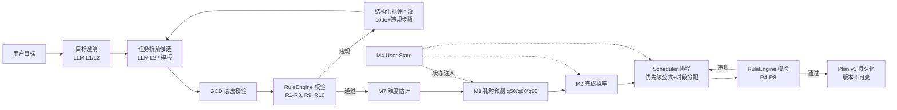
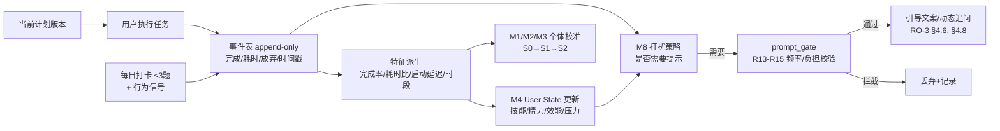
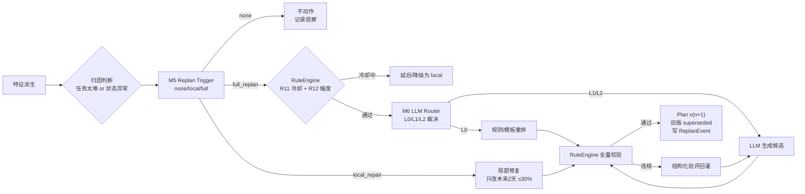

# RO-5 RuleEngine 与决策架构（规则设计 / 裁决 / 数据流）

> **状态**：进行中（15 条 P0 规则已成文，数值待校准）
> **更新时间**：2026-09-20
> **关联文件**：`0-开发指导.md` §7.2–7.5（本 RO 的源；已删除，内容已并入本 RO）、`03-*`、`05-*`、`08-*`、`09-*`、`10-*` 等 `papers.md`、仓库根 `AGENTS.md`（架构约定）
> **依赖的 RO**：**RO-1**（Q1 候选规则与证据）；**RO-2**（模型输出）；**RO-4**（重规划策略）；**RO-7**（标记制度）。被 **RO-3**（prompt_gate R13–R15）、**RO-6**（LLM 输出必须过 RuleEngine）依赖。

> **自足性说明**：RuleEngine 是系统的"裁判"。LLM、模型、Scheduler 都是"球员"——它们可以提议任何方案，但裁判有一票否决权。设计要点是：**规则只管"能不能"，不管"好不好"**（好不好交给 RO-4 §4.2 的评分公式）。`方向N [n]` 指向对应 `papers.md` 卡片；`【工程】`=无文献支撑的工程设定。

---

## 1. 目标

确定规则引擎如何设计（规则对象、清单、优先级、冲突处理），以及决策核心模块的数据流。

---

## 2. 核心问题（含回答）

| # | 问题 | 回答要点 |
|---|---|---|
| 1 | 规则长什么样、怎么注册、怎么触发、怎么处理冲突？ | 规则对象含 `name/code/type/trigger/condition/action/params/evidence/evidence_level/personalizable`（§4.2）；注册进 `default_rules()` 并过一致性检查（§4.4）。 |
| 2 | 规则、模型、LLM、用户意愿冲突时谁优先？ | 六级裁决顺序：安全/伦理 > 用户显式意愿 > RuleEngine 硬约束 > 统计模型 > LLM 候选 > 启发式（§4.1）。 |
| 3 | 决策核心数据如何在部件间流动？ | 三张数据流图：计划生成流 / 执行-反馈流 / 重规划流（§4.5）；部件解释表（§4.6）。 |
| 4 | 上线的规则有多少条？ | P0 **15 条**（§4.3），从 RO-1 的 21 条候选规则中筛选。 |

---

## 3. 所用资料（卡片清单）

| 卡片ID | 文献（首作者 年 简称） | 支撑了什么 | 强度 |
|---|---|---|---|
| 方向3 [4][5] | Bandura & Schunk 1981 / Latham & Seijts 1999 | R1 远端目标必配近端 | 强 |
| 方向3 [31] | Cowan 2001, 组块容量 | R2 组块上限 | 中强 |
| 方向3 [25] | Sebillotte 1988, 层级任务模型 | R3 叶任务可执行性 | 理论 |
| 方向3 [4][5][31] | 同上 | R1/R2/R3 组合 | 强 |
| 方向5 [12][16] | Van Cutsem 2017 / Tucker 2003 | R4 高认知连续上限、R5 缓冲 | 强 |
| 方向5 [7][8] | Hart & Staveland 1988 / Young 2014 | R6 每日负荷上限（数值个性化） | 中强 |
| 方向8 [1][5][20] | Cepeda 2006/2008 / Settles & Meeder 2016 | R7 复习到期强制 | 强/中强 |
| 方向8 [26] | Reddy 2016b, 队列网络 | R8 复习积压上限 | 中强 |
| 方向4 [39] | Emanuel 2025, 估时误差与情绪 | R9 估时保守输出 | ⚠ 预印本 |
| 方向4 [3][8] | Halkjelsvik & Jørgensen 2012/2026 | R10 禁止乐观系数 | 强 |
| 方向9 [25][28] | Vieira 2003 / Gerevini & Serina 2010 | R11 replan 冷却 | 中强 |
| 方向9 [24][28] | Ouelhadj & Petrovic 2009 / Gerevini & Serina 2010 | R12 调整幅度上限 | 中强 |
| 方向9 [9][10] | Winstein & Schmidt 1990 / Hebert & Coker 2021 | R13 提示频率上限、R15 问卷负担熔断 | 中强 |
| 方向9 [6] | Kluger & DeNisi 1996, 反馈干预元分析 | R14 反馈指向检查、R15 | 强 |
| 方向10 [20] | Kambhampati 2024b, LLM-Modulo | 结构化批评回灌、规则权威 | 强 |
| 方向10 [11] | Gou 2024, CRITIC | 外部验证器优于自省 | 中强 |
| 方向10 [19] | Kambhampati 2024a, LLM 规划立场 | LLM 不可单独规划 | 中强 |
| 方向10 [16][17] | Lightman 2024 / Valmeekam 2023 | 步骤级验证 | 强/中强 |
| 方向10 [25] | Park 2025, GCD | 语法约束解码 | 中强 |
| 方向9 [24][25] | Ouelhadj & Petrovic 2009 / Vieira 2003 | 硬约束不可被模型覆盖 | 中强 |
| 方向5 小结 | workload redlines 相关条目 | "存在性不个性化、只有数值个性化" | 中强 |
| 方向9 [3] | Carver & Scheier 1982, 控制论框架 | 闭环"估计→差异→调整" | 理论 |
| 方向9 [29] | Amershi 2014, 交互式机器学习 | 可解释/可追溯输出 | 中强 |

> 完整卡片见对应 `papers.md`；降级条目见 §8.3。

---

## 4. 方案设计

### 4.1 规则与模型冲突时的裁决顺序

> 这是系统最容易打架的地方：模型说"可以"，规则说"不行"，听谁的？

**裁决优先级（高 → 低）**：

1. **安全与伦理底线**（隐私、心理危机、医疗免责）——永远最高。
2. **用户显式意愿与同意**（用户明确说"今天不学"）——不可被模型覆盖。
3. **RuleEngine 硬约束**（每日上限、前置依赖、debuff、deadline、冷却）——硬约束不可被模型或 LLM 覆盖（方向9 [24][25]；项目约定）。
4. **统计模型预测**（M1/M2/M3）——可覆盖启发式/默认值，但不能覆盖硬约束。
5. **LLM 候选建议**——只在通过 1–4 后作为最终候选。
6. **启发式/默认值**——最低。

**冲突处理规则**：
- 模型与**硬约束**冲突 → 硬约束胜，记录 `rule_violation_codes` 与模型预测（用于后续校准）。
- 模型与**软规则/启发式**冲突 → 模型胜，但需记录并可回退。
- 两个模型冲突 → 置信区间更窄/校准更好的胜；无法判断则降级到规则。
- 每次裁决写审计日志（`reason_code`），支持离线复盘。

> 依据：RuleEngine 是硬约束唯一权威（项目约定；方向9 [24][25]）；LLM 输出仅候选（方向10 小结 3）；外部验证器优于自省（方向10 [11][19]）。

### 4.2 规则对象结构（每条规则长什么样）

```json
{
  "name": "daily_load_cap",
  "code": "DAILY_LOAD_EXCEEDED",
  "type": "hard | soft",
  "trigger": "plan_validate | schedule | prompt_gate",
  "condition": "sum(task.q80_min) > user.daily_cap_min",
  "action": "reject | downgrade | defer | drop_question",
  "params": {"cap_default": 0.7},
  "evidence": "方向5 [7][8]；方向4 [39]",
  "evidence_level": "中强",
  "personalizable": true
}
```

字段口径：

| 字段 | 中文名 | 说明 |
|---|---|---|
| `name` / `code` | 规则名 / 违规码 | 必须唯一，注册进 `default_rules()`；违规时 `code` 写入 `rule_violation_codes` 供离线复盘 |
| `type` | 硬/软类型 | `hard` 不可被任何模型/LLM 覆盖；`soft` 可被高置信模型覆盖但需记录（对应 §4.1 第 3、4 层） |
| `trigger` | 触发点 | `plan_validate`（计划校验）/ `schedule`（排程）/ `prompt_gate`（提示门卫） |
| `condition` | 触发条件 | 布尔表达式 |
| `action` | 动作 | `reject` / `downgrade` / `defer` / `drop_question` |
| `params` | 参数 | 规则用到的可调数值 |
| `evidence` | 证据ID | `方向N [n]` 列表 |
| `evidence_level` | 证据强度 | 强/中强/中/理论/⚠ |
| `personalizable` | 数值可否个性化 | **规则的存在性不个性化，只有数值个性化**（方向5 小结：上限概念成立、数值无普适值） |

### 4.3 P0 规则清单（15 条，可直接写代码）

> 这 15 条从 **RO-1 §2 Q1 的 21 条候选规则**中筛选（选标准：证据强/中强 + 变量可观测 + 属 P0 闭环必需）。规则的**方向**来自文献；**分界线数值**为【工程】（见 §8.2）。

| # | 规则名 | 触发点 | 条件 → 动作 | 依据 | 类型 |
|---|---|---|---|---|---|
| R1 | 远端目标必配近端子目标 | `plan_validate` | 计划无 ≤7 天可完成的子目标 → `reject` | 方向3 [4][5] | hard |
| R2 | 组块上限 | `plan_validate` | 单次呈现子任务 >4 个 → 要求合并 | 方向3 [31] | hard |
| R3 | 叶任务可执行性 | `plan_validate` | 叶任务不可言语化/无完成判据 → `reject` | 方向3 [25]（Sebillotte 层级任务模型） | hard |
| R4 | 高认知连续上限 | `schedule` | 连续高认知任务 >2 → 强制插入缓冲/降级 | 方向5 [12][16] | hard |
| R5 | 任务间缓冲 | `schedule` | 任务间无 ≥10min 缓冲 → 自动插入 | 方向5 [12][16] | hard |
| R6 | 每日负荷上限 | `schedule` | 当日总 q80 > `daily_cap` → 溢出任务顺延 | 方向5 [7][8]；方向4 [39] | hard（数值个性化） |
| R7 | 复习到期强制 | `schedule` | `recall_prob < θ` 且未排复习 → 插入复习任务 | 方向8 [1][5][20] | hard |
| R8 | 复习积压上限 | `schedule` | `backlog > 上限` → 暂停新内容，先清积压 | 方向8 [26] | hard |
| R9 | 估时保守输出 | `plan_validate` | 任务估时未用 q80 → 重算 | 方向4 [39] | hard |
| R10 | 禁止乐观系数 | `plan_validate` | 估时含固定压缩系数 → `reject` | 方向4 [3][8] | hard |
| R11 | replan 冷却 | `replan` | 距上次 full_replan <48h → `reject`（per-user） | 方向9 [25][28] | hard |
| R12 | 调整幅度上限 | `replan` | 单次改动任务 >30% → 降级为 `local_repair` | 方向9 [24][28] | hard |
| R13 | 提示频率上限 | `prompt_gate` | 当日提示 >3 次 → 丢弃 | 方向9 [9][10] | hard |
| R14 | 反馈指向检查 | `prompt_gate` | 文案含人格评价关键词 → 丢弃 | 方向9 [6] | soft |
| R15 | 问卷负担熔断 | `prompt_gate` | 当日题量 >5 或熔断激活 → 丢弃非必答题 | 方向9 [6][9][10] | hard |

**与候选规则的映射**（保持可回查）：R1↔RO-1 R3/R4；R2↔R5；R3↔R3；R4/R5↔R9；R6↔R10；R7↔R12/R13；R8↔R8（复习积压，RO-1 未单列）；R9/R10↔R16/R17；R11↔RO-4 D7；R12↔RO-1 R15 的工程化；R13/R15↔RO-3 D10；R14↔R14。RO-1 中未进入 P0 的候选（如 R6 学习目标、R7 高厌恶拆小、R11 交错、R18 时段匹配）由 **Scheduler/Plan Generation 默认行为**承担，暂不设为硬拦截（见 RO-4）。

### 4.4 执行流程与冲突处理

```text
候选计划（LLM/模板/修复） → GCD 语法校验 → RuleEngine 逐规则评估
  → 全部通过：进入 Scheduler 评分排序
  → 存在 hard 违规：reject + 结构化违规清单（code + 违规任务 + 原因）回灌生成端
  → 仅 soft 违规：放行但记录，进入事后校准池
```

- **规则之间不冲突**：设计约束——任何两条 hard 规则不得在同一输入上给出相反动作；新增规则需在 `default_rules()` 注册时通过一致性检查（项目约定，D19）。
- **规则 vs 模型**：按 §4.1 裁决顺序；模型只影响 soft 规则的数值参数，永远不能改写 hard 规则。
- **规则 vs 用户**：用户显式意愿高于 RuleEngine（§4.1 第 2 层）——用户说"今天就要学 10 小时"，系统执行但标记风险并弱化次日负荷。
- **违规回灌**：结构化、机器可读、按步骤分解（方向10 [20]）；反馈必须能被下游读懂并触发重生成。

### 4.5 决策核心数据流（概念层）

> 下面三张图是系统的"血液循环图"。**方框是部件，箭头是数据**。每张图后面附部件解释表（§4.6）。

#### 4.5.1 图一：计划生成流（用户提出目标 → 首版计划）



#### 4.5.2 图二：执行-反馈流（每天发生，系统的主循环）



#### 4.5.3 图三：重规划流（计划跑偏 → 调整）



### 4.6 关键部件解释表

| 部件 | 通俗解释 | 职责（一句话） | 详细设计定位 |
|---|---|---|---|
| **GCD 语法校验** | "格式检查员"：只查 JSON 字段合不合法，不管内容对不对 | 保证 LLM 输出结构可被系统解析 | RO-6 §4.3 输出层 |
| **RuleEngine** | "裁判"：一票否决权，只看规则不看聪明不聪明 | 硬约束唯一权威，产出结构化违规清单 | 本文 §4 |
| **结构化批评回灌** | "批改意见"：不是简单说"错了"，而是写清哪一步违反哪条规则 | 让 LLM 修复时有明确依据（方向10 [20]） | 图一/图三；RO-6 |
| **Scheduler** | "排课老师"：只在裁判放行的合法方案里挑最优顺序 | 评分排序+时段分配+缓冲插入，绝不调 LLM | RO-4 |
| **M1–M8 模型群** | "参谋团"：各自估计一个量（多久/能否完成/何时复习…） | 向 Scheduler 和门控提供预测与状态 | RO-2 |
| **事件表（append-only）** | "流水账"：只增不改，一切结论都能回溯到原始记录 | 所有模型与复盘的唯一数据源 | RO-3 §4.5；§4.7 |
| **特征派生** | "会计"：定期把流水账汇总成指标（完成率、耗时比…） | 事件 → 模型输入特征的转换层 | RO-3 §4.5 |
| **M8 打扰策略** | "前台接待"：决定什么时候可以敲用户的门 | 提示/追问的频率与时机裁决 | RO-2 §4.8；RO-3 §4.6 |
| **prompt_gate** | "门卫"：提示和追问出门前最后检查 | R13–R15 频率、措辞、负担熔断 | RO-3 §4.8.4–4.8.5 |
| **M6 LLM Router** | "调度员"：决定这活交给规则、小模型还是大模型 | 三层门控 L0/L1/L2 + abstain | RO-6 §4.1 |
| **M5 Replan Trigger** | "报警器"：判断要不要调整计划、调多大 | none/local/full 三档触发 | RO-2 §4.5；RO-4 §4.10 |
| **Plan 版本** | "快照"：每版计划不可变，改了就是新版本 | 可回溯、可对比、可归因 | 项目约定；§4.7 |
| **PlanService** | "总经办"：编排上面所有部件，注入依赖 | 事务拥有者，驱动 LangGraph 流程 | 项目约定（根 `AGENTS.md`） |

### 4.7 数据流与事务（工程约定）

- 采集事件 → 追加式事件表（append-only）→ 派生特征（批/流）→ 模型更新 → 计划版本。
- Repositories 只 `flush()`，Service 拥有事务（项目约定）。
- 计划版本不可变：重规划生成 v(n+1)，旧版 superseded，写 ReplanEvent，`parent_plan_id` 链接（项目约定）。
- 模型参数与策略版本号入日志，保证 A/B 可归因。
- **LLM 不碰 DB、不改状态**：它只产候选与建议（方向10 [8][10]；项目约定）。

### 4.8 跨模块接口契约表

> 接口字段名为建议，可替换；来源栏指向该接口依据的文献结论。五条原则见下。

| 接口 | 方向 | 关键字段 | 依据 |
|---|---|---|---|
| Router → LLM | 请求 | `task_kind`（语义/形式化）、`uncertainty`、`budget` | 方向10 [1][2][5][6] |
| LLM → RuleEngine | 候选 | `PlanDraft{steps[], subgoals[], cue?}` | 方向10 [20]；方向3 [12] |
| RuleEngine → LLM | 批评 | `violations[{code,severity,message,fix_hint}]`（机器可读） | 方向10 [20] |
| RuleEngine → Scheduler | 合法计划 | `ValidatedPlan`（含完成判据、粒度、间隔约束） | 方向3 [1][25][31]；方向8 [1][5] |
| User State → Scheduler | 状态 | `chronotype`、`workload_redline`、`fatigue`、`goal_proximity` | 方向7 [3][5]；方向5 [8]；方向3 [18] |
| Scheduler → Duration Predictor | 任务 | `theoretical_duration`、`task_type`、`historical_duration` | 方向4 [10][15][20] |
| Duration Predictor → Scheduler | 估时 | `{median, p80, uncertainty}` | 方向4 [32][33][39] |
| 执行 → Feedback | 事件 | `start/end/interrupt`、`self_report`、`affect`、细粒度活动 | 方向4 [22][24][39]；方向9 [12] |
| Feedback → User State | 更新 | 快变量/慢变量分流更新 | 方向11 [9][11][14]；方向1 [6][21] |
| User State → Review Scheduler | 知识状态 | `retention_probability`、`skill_mastery` | 方向8 [19][20]；方向11 [9][11] |
| Replanning → Scheduler | 修订 | `reschedule_trigger`、`scope{local|global}` | 方向9 [24][25][28] |
| 一切 → 执行记忆 | 沉淀 | `{goal_embedding, plan, outcome, cost}` | 方向10 [13][14][22] |

**五条接口设计原则**（对应图一~图三）：
1. **单向可追溯**：每个模块的输出都要带"来源与理由"，便于回放与审计（方向9 [29]）。
2. **LLM 不碰 DB、不改状态**：它只产候选与建议（方向10 [8][10]）。
3. **硬约束前置**：规则校验放在生成之后、执行之前（方向10 [11][20]）。
4. **区间优于点值**：估时与负荷都给区间/分位数（方向4 [32][39]）。
5. **代价必须可见**：状态更新与评估都要包含疲劳/情绪/放弃等代价指标（方向6 [6]；方向4 [39]）。

> 接口契约表与五条原则原属 `00-汇总映射.md` §九；本 RO 将其就近并入"决策核心数据流"，与三张图/部件表同文档。

---

## 5. 已确认结论

| # | 结论 | 证据ID | 强度 |
|---|---|---|---|
| E-1 | 外部验证优于 LLM 自省 → RuleEngine 作为硬约束唯一权威有直接学术背书 | 方向10 [20] | 强 |
| E-2 | 结构化批评（违规 code + 步骤）回灌优于整单驳回 | 方向10 [20] | 强 |
| E-3 | 规则"存在性不个性化、只有数值个性化" | 方向5 [8] | 中强 |
| E-4 | 语法层（GCD）与语义层（RuleEngine）分工：前者保格式、后者查业务 | 方向10 [25] | 中强 |
| E-5 | 步骤级验证优于只看最终结果 | 方向10 [16][17] | 强 |

---

## 6. 决策记录（D-x）

| 决策 | 内容 | 依据 | 状态 |
|---|---|---|---|
| **D3** | 规则存在性不个性化，只有数值个性化 | 方向5 [8] | 已决定 |
| **D4** | RuleEngine 为硬约束唯一权威，LLM 输出仅为候选 | 方向10 [11][19][20] | 已决定 |
| **D9** | 范围决策：不做 MoA、不做深度 RL 主排程、不做生理传感器闭环 | 方向10 [28]；方向8 [24]；方向1 [18] | 已决定 |
| **D18** | 15 条 P0 规则的方向来自文献，分界线数值为【工程】 | 见 §4.3 各行 | 已决定 |
| **D19** | 规则注册需通过"同输入无相反动作"一致性检查 | 项目约定 | 已决定 |

---

## 7. 未决问题

| # | 问题 | 建议动作 |
|---|---|---|
| T-5.1 | 规则数值（≤7 天、>4 组块、>2 连续、≥10min、>3 次、>5 题、<48h、>30%）全部待校准 | 上线后 A/B / MRT 校准 |
| T-5.2 | soft 规则被高置信模型覆盖的"门槛"（多高算高）未定 | 待模型校准指标确定后定义 |
| T-5.3 | 规则库版本化与灰度发布机制未设计 | 需工程立项 |
| T-5.4 | R14 反馈指向检查的"人格评价关键词"词表未定义 | 需构建并人工抽检 |

---

## 8. 溯源审计（本 RO 全部论断核验 + 工程默认值逐条认领）

### 8.1 依据判定表

| 论断 | 证据ID | 判定 |
|---|---|---|
| 裁决顺序第 3 层"硬约束不可被模型覆盖" | 方向9 [24][25]；项目约定 | 【文献】+ **【工程】** |
| 裁决顺序第 5 层"LLM 仅候选" | 方向10 [19][20] | 【文献】 |
| 规则对象三枚举 `type/trigger/action` | 无卡片 | **【工程】** |
| `personalizable`：存在性不个性化、数值个性化 | 方向5 [8] | 【文献】 |
| R1 远端目标必配近端子目标 | 方向3 [4][5] | 【文献】 |
| R2 组块上限 >4 | 方向3 [31] | 方向【文献】；"4"是【工程】 |
| R3 叶任务可执行性/完成判据 | 方向3 [25] | 【文献】 |
| R4 高认知连续 >2 | 方向5 [12][16] | 方向【文献】；"2"是【工程】 |
| R5 缓冲 ≥10min | 方向5 [12][16] | 方向【文献】；"10min"是【工程】 |
| R6 每日上限阈值 | 方向5 [7][8] | 概念【文献】；数值【工程】 |
| R7 复习到期强制、`recall_prob<θ` | 方向8 [1][5][20] | 【文献】；θ 是【工程】 |
| R8 积压上限 | 方向8 [26] | 概念【文献】；数值【工程】 |
| R9 估时用 q80 | 方向4 [39] | 【外推】 |
| R10 禁止乐观系数 | 方向4 [3][8] | 【文献】 |
| R11 replan 冷却 <48h | 方向9 [25][28] | 方向【文献】；"48h"是【工程】 |
| R12 幅度上限 >30% | 方向9 [24][28] | 方向【文献】；"30%"是【工程】 |
| R13 提示 >3 次/天 | 方向9 [9][10] | 方向【文献】；"3"是【工程】 |
| R14 反馈指向检查（人格关键词） | 方向9 [6] | 【文献】；词表【工程】 |
| R15 题量 >5、熔断 | 方向9 [6][9][10] | 机制【文献】；数值【工程】 |
| 一致性检查"同输入无相反动作" | 项目约定 | **【工程】** |
| 三张数据流图的形状/部件/箭头 | 项目架构 | **【工程】** |
| 事件表 append-only、事务归属、计划版本不可变 | 项目约定 | **【工程】** |

### 8.2 本 RO 新增的默认值（逐条认领）

| 内容 | 位置 | 类型 |
|---|---|---|
| 15 条规则的具体阈值（≤7 天、>4 组块、>2 连续、≥10min、>3 次、>5 题、<48h、>30%、θ） | §4.3 | 【工程】 |
| 规则对象 JSON 字段设计、`type/trigger/action` 枚举 | §4.2 | 【工程】 |
| 规则注册一致性检查机制 | §4.4 | 【工程】 |
| 数据流图形状、部件划分、箭头方向 | §4.5 | 【工程】 |
| 部件解释表的部件清单 | §4.6 | 【工程】 |
| 数据流与事务约定 | §4.7 | 【工程】 |

### 8.3 降级条目提醒

- 方向4 [39] 为 PsyArXiv 预印本：R9"估时用 q80"取其为方向依据，属【外推】。
- 方向2 [13] 已撤稿，本 RO 未引用。
- 方向4 [33]（medRxiv）仅作 M1 S2 方向参考，不作规则依据。

---

## 9. 变更日志

| 日期 | 变更 | 触发 |
|---|---|---|
| 2026-09-20 | 从 `0-开发指导.md` §7.2–7.5 抽取，形成本 RO | 用户要求按 RO 拆分 |
| 2026-09-20 | **本文件生成**：15 条规则 + 三张数据流图 + 部件解释表集中于同一文档，满足"图与解释同文档"要求 | 用户要求按 RO 拆分 |
